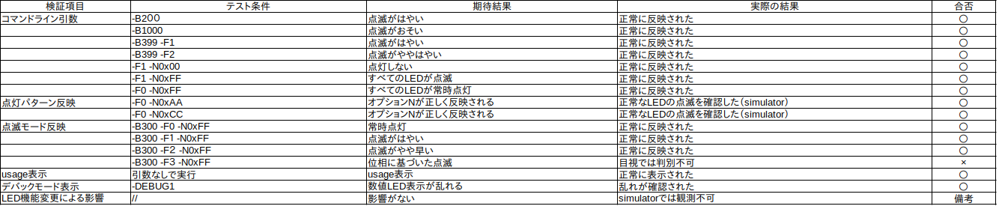
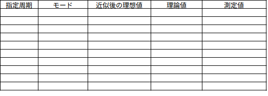

# LED点滅実装検証報告書

作成日2025年X月XX日  
宇部工業高等専門学校 制御情報工学科4年99番
宇部太郎
＿＿＿＿＿

## 1. 実験方法
<!--
「仕様書」「ソースコード」をもとに、あなたの実験結果を再現するために必要な情報を記述してください。例えば「H8とオシロの型番」「H8とオシロの接続（どこを図るか）」「オシロの設定」などは記載されていません。一方で、「H8本体と周辺機器の接続」については仕様書に明記されているため割愛して構いません。
-->

## 2. 機能検証（定性的検証）

### 検証結果の概要



### 実行コマンド例と結果

```
（コマンド実行例をここに記載）
```

（スクリーンショットまたはテキストコピーを貼り付け）

---

## 3. 非機能検証（定量的検証）

### テストケース一覧



### 測定波形

（オシロスコープの波形画像を以下に添付）

---

## 4. 考察

* ## 機能検証で確認された問題点や特記事項

* ## 非機能検証の結果からわかる傾向や特記事項

* ## 理論値と測定値の差異に関する考察

* ## 全体的な評価と今後の改善提案

---

## 付録：ソースコード

### main.c
@import "../src/main.c"

### led.h
@import "../src/led.h"

### led.c
@import "../src/led.c"
